# How might we reinterpret Metal Stamping using wood, screws and 3D printer in D&I workshop?
# 我们如何在D&I工坊中利用木材、螺丝以及 3D 打印机来重新诠释金属冲压工艺？

## Key words - Brainstorming   关键词 - 头脑风暴

Our brainstorming began with the materials. We came up with the idea that substances like cement, corrugated paper, and even ice cubes might be able to represent the process of metal stamping.

我们的头脑风暴首先从材料入手，我们联想到用水泥、瓦楞纸甚至冰块可能可以实现金属冲压过程的诠释

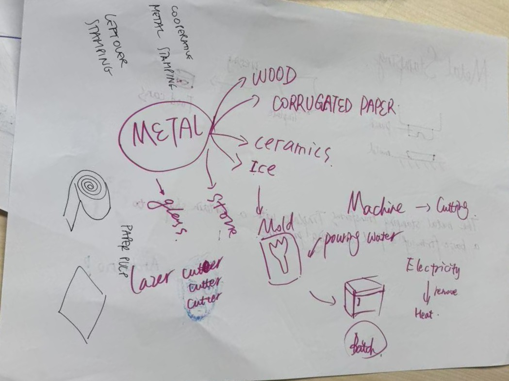

Next, we recall the process of metal stamping. It applies pressure to the metal sheet through a mold, causing it to undergo plastic deformation, thereby obtaining the desired shape. However, since it requires a great deal of mechanical energy, we pondered: 

1. How can we replace this process with limited mechanical energy (such as the strength of the arm)?
   
2. Should we replace it with some materials that are more malleable and softer, or with thinner and lighter metals (such as aluminum sheets, tin foil sheets)?
   
3. How can we provide the energy needed for stamping?

接着我们回想金属冲压的流程。它通过模具对金属板材施加压力，使其塑性变形，从而获得所需形状。但由于它需要强大的机械能量，所以我们思考：

怎么用有限的机械能（比如手臂的力量）来代替这个工艺？

是换一些延展性比较好且比较柔软的材料、还是薄一点轻一点的金属（如铝片、锡纸片）？

我们如何提供冲压所需的能量？

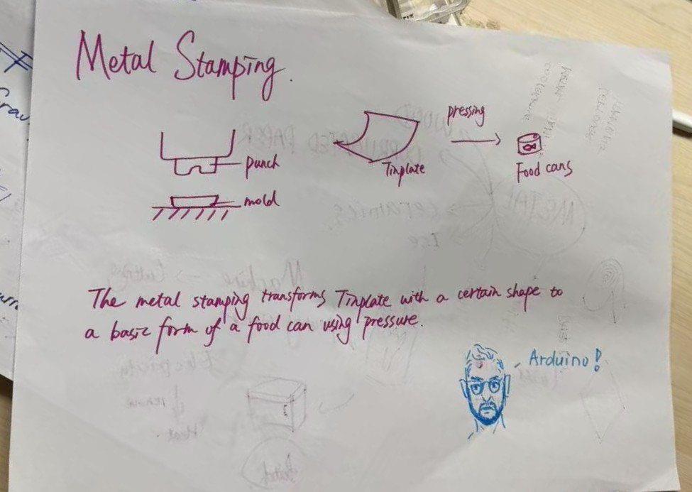

## 初步想法
We have come up with two initial plans:

1. "Scissors" model

Fix the wooden stick with screws, design the handle at one end to be slightly longer, and the other end of the mold to be shorter. Hold the handle with both hands and press inward to achieve "stamping" by leveraging the force of the lever.

我们想出两个初步方案：

1. ”剪刀“ 模型

用螺丝固定木棒，手持一端设计稍长，模具一段较短，双手握住手柄向内夹，这样就可以借助杠杆的力量进行”stamping“。

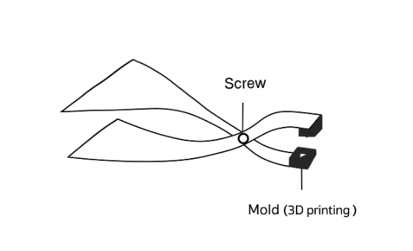

2. "Rotation" model

Design the "stamping machine" as shown in the picture, with a groove on the outside. By rotating the handle on the outside, the concave mold can gradually approach and gradually clamp the convex mold, thus achieving the "stamping" process.

2. ”旋转“模型
   
将”冲压机“设计成如图的，有凹槽的模型，通过旋转外侧的手柄，可以让凹模慢慢接近并逐渐夹紧凸模，实现”stamping“的过程

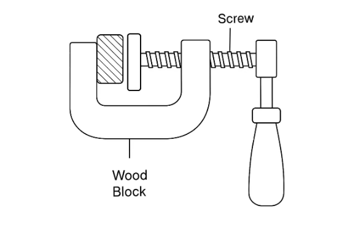

Required materials: screws, 3D printing molds, wood, wood glue

需要材料：螺丝、3D打印模具、木材、木工胶

## 草模制作

We selected some materials: cardboard, wire, paper cups, clay and double-sided tape to illustrate our concept.

我们选取了一些材料：硬纸板、铁丝、纸杯、粘土、双面胶来诠释我们的构思

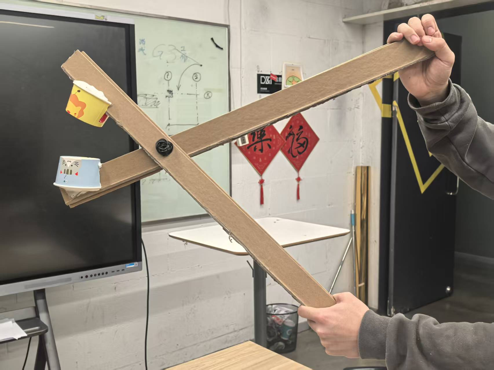

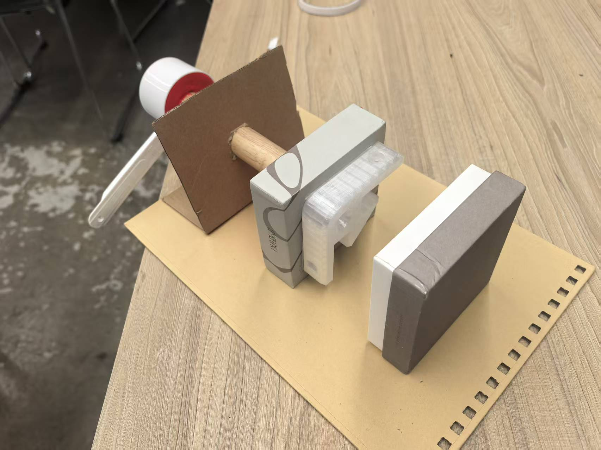

## 模型制作

We finally decided to combine the two approaches: using a rotatable "Fibonacci" wooden pendulum to apply a force to the movable die, pushing it towards the fixed die, to complete the "pressing" process and print out the "Mahjong" bread.

我们最终决定结合两个方案：用可旋转的“斐波那契”木摆锤，向可移动的凸模施加推力，推向固定的凹模，完成“冲压”过程，印出“麻将”面包

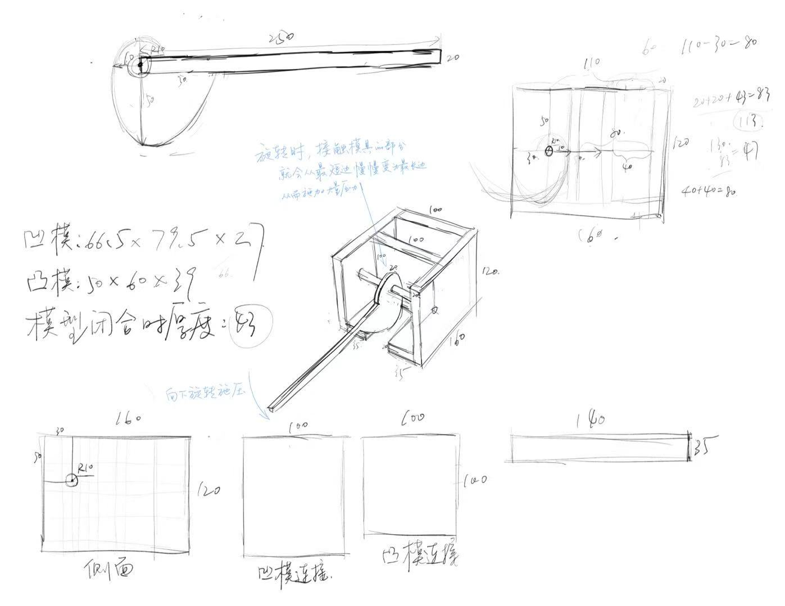

Using glued wood panels, the main structure was built by cutting and gluing.

采用胶合木板，进行切割、粘贴完成主体搭建

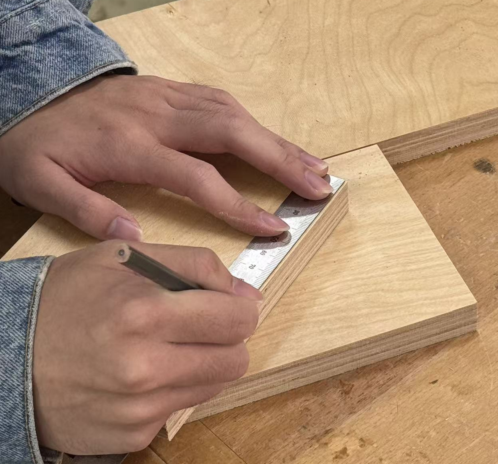

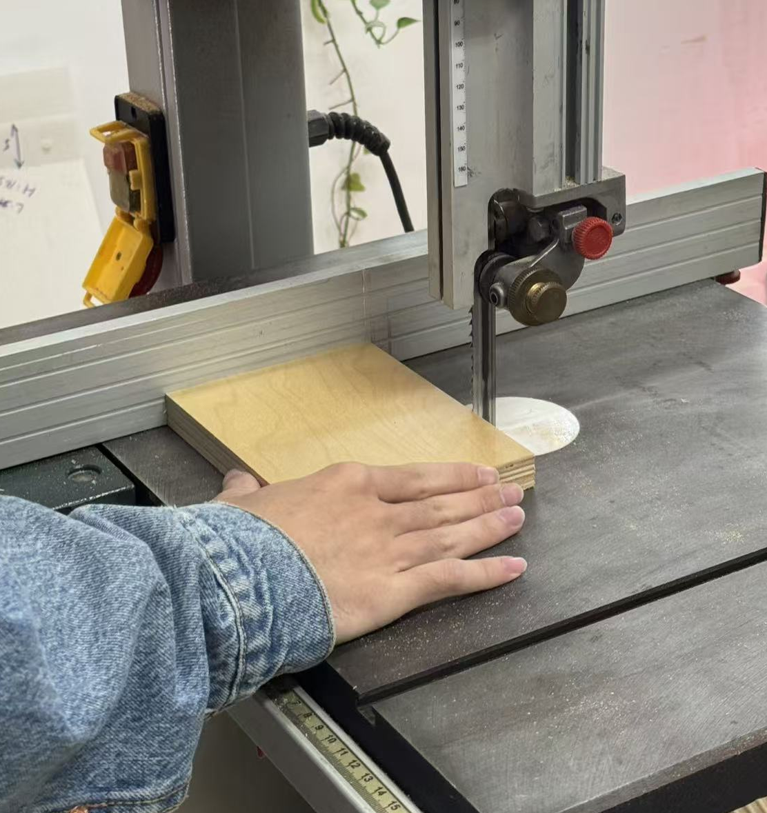

3D Modeling in Blender, the concave die, convex die and fixed opening of the mahjong mold were constructed, and then 3D printing was carried out using PLA material.

用Blender建模，完成麻将模具凹模、凸模、固定口的搭建，并用PLA材料进行3D打印

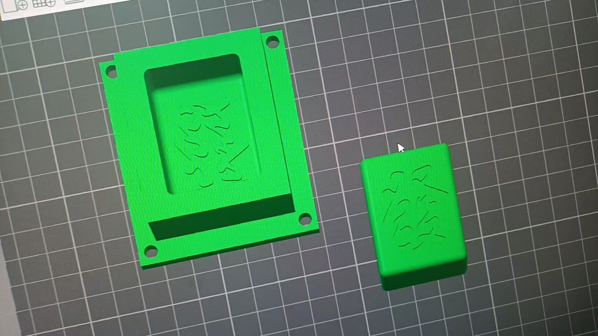

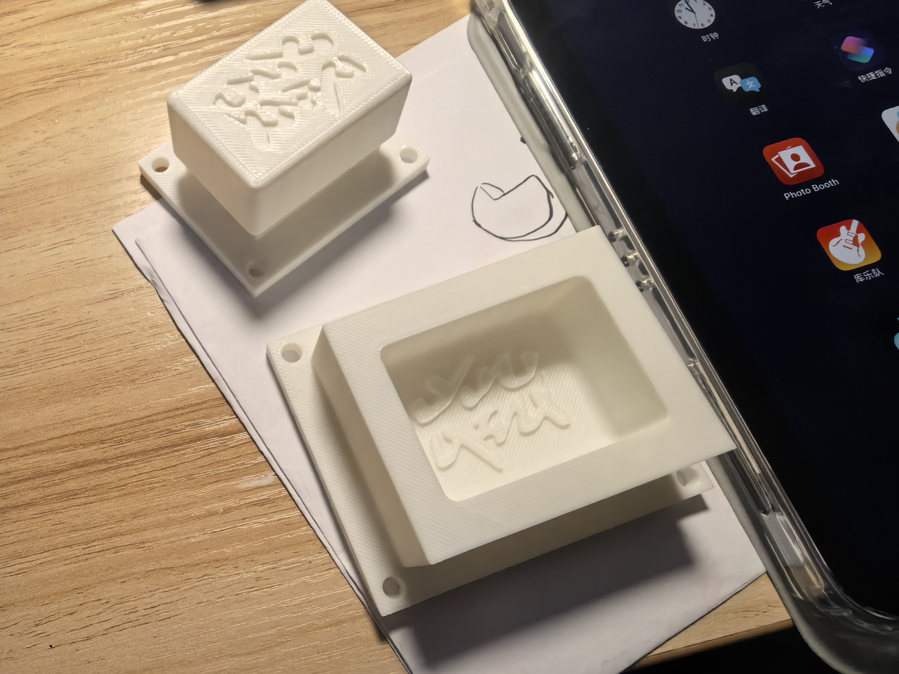

Assemble our model, mainly using screws and glue for reinforcement.

将我们的模型进行组装，主要用螺丝、胶水进行加固

We also polished the parts where the mold and the wooden board came into contact to reduce the friction.

我们还将模具和木板接触的部分进行打磨，以减小摩擦力

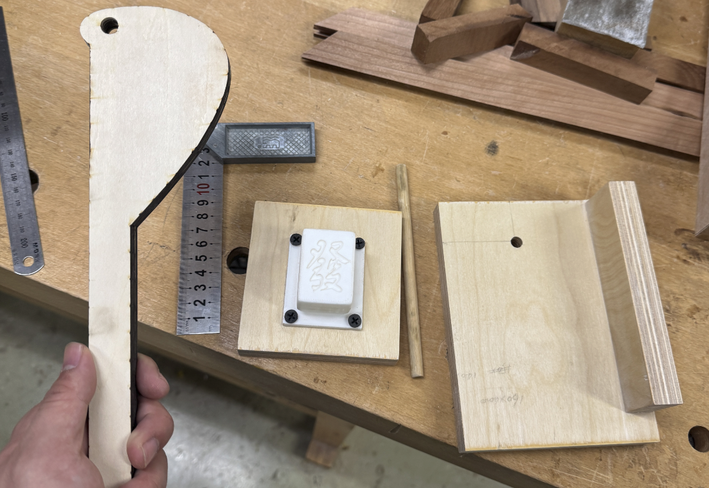

Done

完成！

## Maker Faire展览

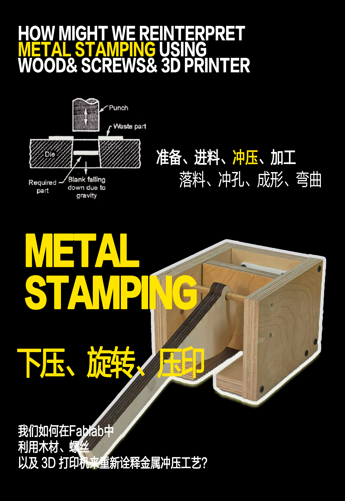

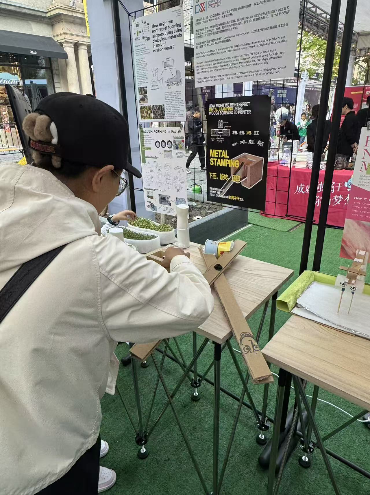

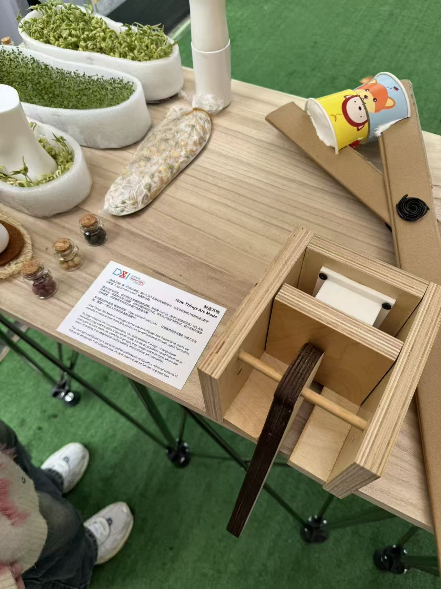
